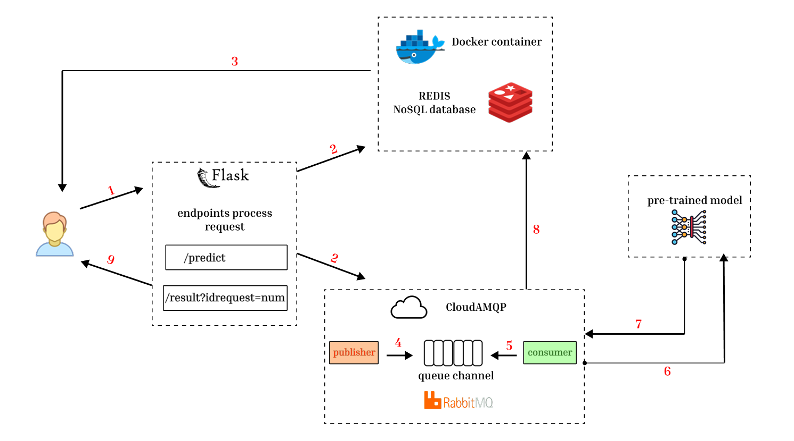

## Mitigating Latency under High Concurrency: A Messaging-Driven Architecture for AI Inference Workloads

Synchronous architectures, such as conventional RESTful APIs, face significant challenges in responsiveness and availability when handling long-running computational tasks like AI inference, particularly under high concurrency. This repository presents an asynchronous, messaging-driven architecture designed to overcome these limitations. We conducted a comparative analysis of our proposed system, which utilizes a message broker and a persistent data store, against a traditional REST-based approach using a simulated AI workload. The results demonstrate that our architecture maintains constant, sub-second initial response times, thereby ensuring continuous endpoint availability. In contrast, the performance of the synchronous REST API degraded significantly as concurrent requests increased. By decoupling the initial request from the final result delivery, our approach enhances system scalability and improves the user experience for time-intensive operations.

### Proposed system

The inference process is built on a modular and scalable architecture to support asynchronous task execution.
- A Flask-based web service is responsible for receiving user inputs and initiating the inference workflow.
- A Redis NoSQL database, deployed within a Docker container, temporarily stores user inputs and prediction results.
- A cloud-based RabbitMQ system, implementing the AMQP protocol, manages message delivery between producers (web service) and consumers (background workers).
- The pre-trained AI model, trained on a task-specific dataset, performs the inference and returns results through the system pipeline.

**For more details, visit the paper [the paper](url)**
## The command to install the libraries
- pip install flask redis pika requests
## External Tools
- Redis Server (should be running locally on port 6379)
- RabbitMQ Cloud instance (uses a CloudAMQP connection)
### Command to run Redis inside a Docker container
- docker run -d --name redis-stack -p 6379:6379 -p 8001:8001 redis/redis-stack:latest
### Available endpoints:
- http://127.0.0.1:5000/factorial?no=<number_to_claculate> 
- http://127.0.0.1:5000/factorial/result?id=<id_request>
### Workflow Summary Example:
#### 1 User sends request:
- Sends *GET /factorial?no=5* to the Flask app.

#### 2 Flask server:

- Generates a request ID.
- Stores the input and "processing" status in Redis.
- Sends a message to the RabbitMQ queue factorial_process.

#### 3 Consumer:
- Listens to the queue.
- Picks up the message.
- Calculates factorial (e.g., 5! = 120).
- Update the body JSON through the post request. *POST /factorial/update*.

#### 4 User retrieves result:
- Sends *GET /factorial/result?id=<request_id>* and gets the final result **{input: 5, output: 120, status: done}**
